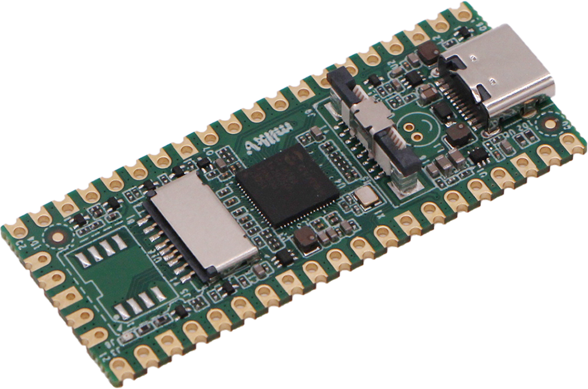

# MilkV Embedded Linux Development Workspace



## Table of Contents

- [Introduction](#introduction)
- [Getting Started](#getting-started)
  - [Prerequisites](#prerequisites)
  - [Setting Up the Workspace](#setting-up-the-workspace)
- [Applications](#applications)
  - [SPI Examples](#spi-examples)
    - [LoRa](#lora)
  - [I2C Examples](#i2c-examples)
    - [OLED Display](#oled-display)
  - [Arduino Mailbox](#arduino-mailbox)
  - [Network Scanner](#network-scanner)

## Introduction

Welcome to my personal Milk-V Duo Development Workspace! This repository provides a environment for developing embedded Linux applications targeting the Milk-V board. 

## Getting Started

### Prerequisites

Before you begin, ensure you have the following prerequisites in place:

- A Milk-V duo board
- A Linux host machine with the required toolchain and libraries.
- Additional hardware components or modules:
  - LoRa RFM95 Module
  - TFT Display ST7789

### Setting Up the Workspace

1. **Clone the Repository:**

   ```bash
   git clone https://github.com/your-username/milkv-embedded-linux-workspace.git
1. **Navigate to the Workspace Directory:**
    ```bash
   cd milkv-embedded-linux-workspace
1. **Install the board SDK:**
    ``` bash
    git clone https://github.com/milkv-duo/duo-examples.git
    
    cd duo-examples
    
    source envsetup.sh

## Applications
### SPI Examples
#### LoRa Module
...

### I2C Examples
#### OLED Display
...

### Arduino Mailbox

### Network Scanner
This project implements a lightweight network scanner that runs on the Milk-V Duo. 

The scanner uses raw sockets to send ARP requests over an Ethernet interface (e.g., eth0) and displays information about connected devices on the local network, such as their IP addresses, MAC addresses, and response times (RTT).

Parallel to the Linux core app, an Arduino app receives the big core's IP address, number of connected devices in the network and the core's temperature.

**Run big core's app at start:**
1. Copy the bash script to the duo:
```
scp network_scan_init root@192.168.42.1
```

Or create init.d file:
```
[root@milkv-duo]~# vi /etc/init.d/network_scan
```
and write down its contents:
```
#!/bin/sh
# /etc/init.d/network_scan_init

case "$1" in
    start)
        echo "Starting Network Scan"
        ./root/network_scan &
        ;;
    stop)
        echo "Stopping Network Scan"
        killall network_scan
        ;;
    *)
        echo "Usage: /etc/init.d/network_scan_init {start|stop}"
        exit 1
        ;;
esac

exit 0
```
2. Make the script executable:
```
chmod +x /etc/init.d/network_scan_init
```
3. Set the code execution by adding the following line to /etc/inittab:
```
::sysinit:/etc/init.d/network_scan_init start
```